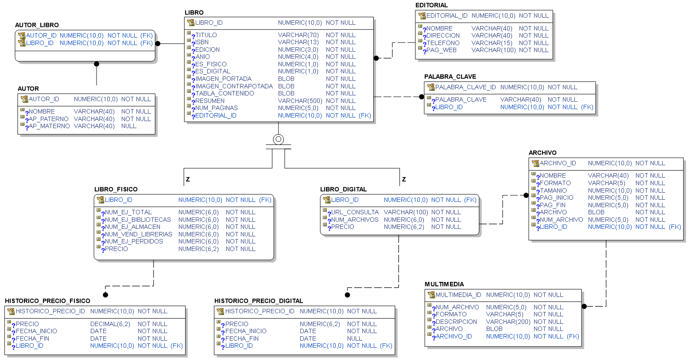

# schoolbook-libros
Este servicio se encarga de realizar la administración del acervo de libros que ofrece SchoolBook

La definición del caso de estudio completo se puede revisar en este [enlace](https://github.com/school-book/schoolbook-app/blob/master/docs/caso-estudio.md)

### Entidades principales

- Libro
- Autor
- Autor Libro
- Editorial
- Palabra Clave
- Lista Palabra Clave
- Libro Físico
- Libro Digital
- Histórico Precio Físico
- Histórico Precio Digital
- Archivo
- Multimedia

### Modelo relacional

